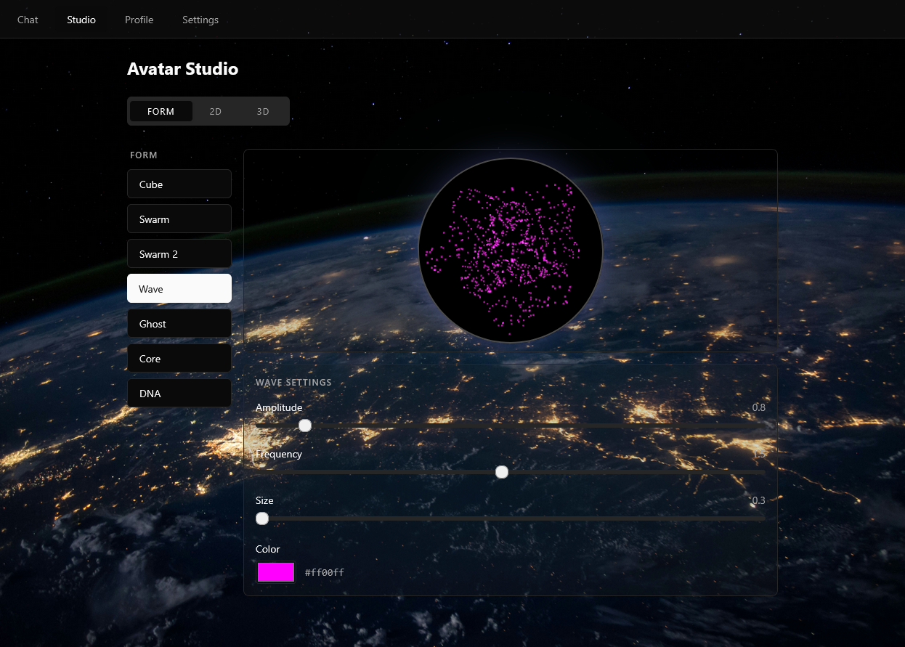

AI Avatar Studio & Interactive Chat

A containerized, privacy-focused web application that brings Large Language Models (LLMs) to life. Going far beyond static 2D images or standard 3D meshes, this project creates an embodied AI presence complete with zero-dependency real-time lip-sync, dynamic eye contact, and high-fidelity text-to-speech.

It bridges the gap between abstract AI assistants and tangible interaction—running locally where possible, scaling to the cloud when needed.
🌟 The "Illusion of Life" (More than just a 3D Model)

The core philosophy of this project is to make the AI feel present and responsive. The avatar engine is built on @pixiv/three-vrm and features a suite of autonomous behaviors:

    Dynamic Canvas-Relative Mouse Tracking: The avatar maintains natural eye contact. It calculates its own bounding box on your screen and smoothly lerps its head and neck bones to follow your cursor.

    Zero-Dependency Smart Lip-Sync: No heavy backend phoneme calculation is needed. The frontend utilizes the native Web Audio API to analyze TTS frequency peaks in real-time, dynamically snapping the avatar's jaw muscles (aa blendshape) to match spoken syllables.

    Autonomous Idling & Blinking: The avatar feels alive even when silent, utilizing randomized time-based loops to trigger natural blinking animations.

    Bilingual Auto-Adaption: The AI seamlessly detects the language of your input (English/German). It automatically adjusts its LLM system prompt and dynamically switches to the correct native Text-to-Speech voice profile on the backend without requiring any UI toggles.

    Per-Model Memory: The studio features a smart localStorage memory. When switching between multiple uploaded .vrm models, the application remembers your specific scale and Y-offset configurations for each individual character.
Layer,Technology
Frontend,"React 19, Vite 6, Tailwind CSS, Three.js, @react-three/fiber, @pixiv/three-vrm"
Backend,"Python 3.12, FastAPI, Uvicorn"
Audio / TTS,edge-tts (Microsoft Neural voices - Male/Female/Robot profiles)
Infrastructure,"Docker, Docker Compose (Fully containerized architecture)"
LLM Engine,"OpenRouter API, Ollama (Local LLMs), OpenAI, Anthropic, Gemini"

🚀 Quick Start
1. Clone and Configure
git clone <your-repo-url>
cd AI-Avatar

# Setup environment variables
cp .env.example .env
Edit .env and add your API keys (e.g., OPENROUTER_API_KEY)

2. Start Services (Docker-First)

The entire stack is containerized for maximum reproducibility. No local Node or Python installations are required on your host machine.

docker compose up --build
 Senior Software Development Assistant
Benutzerdefiniertes Gem
Senior Software Development Assistant hat gesagt:

Das ist eine hervorragende Idee. Weg mit den Arbeitstiteln und alten Plänen, hin zu einem Showcase-README, das sofort beeindruckt, wenn jemand (oder ein Arbeitgeber) auf dein Repository klickt.

Wir setzen jetzt den Fokus voll auf die "Illusion of Life" – also die Tatsache, dass es nicht einfach nur ein 3D-Modell ist, sondern ein Wesen, das dir in die Augen schaut, blinzelt, zuhört und die Lippen synchron zur Sprache bewegt. Die Screenshot-Platzhalter habe ich direkt oben als visuelles Highlight eingebaut.

Kopiere den folgenden Text und ersetze damit den kompletten Inhalt deiner aktuellen README.md (alles ist auf Englisch, professionell formatiert und bereit für deine eigenen Bilder):
AI Avatar Studio & Interactive Chat

A containerized, privacy-focused web application that brings Large Language Models (LLMs) to life. Going far beyond static 2D images or standard 3D meshes, this project creates an embodied AI presence complete with zero-dependency real-time lip-sync, dynamic eye contact, and high-fidelity text-to-speech.

It bridges the gap between abstract AI assistants and tangible interaction—running locally where possible, scaling to the cloud when needed.
🌟 The "Illusion of Life" (More than just a 3D Model)

The core philosophy of this project is to make the AI feel present and responsive. The avatar engine is built on @pixiv/three-vrm and features a suite of autonomous behaviors:

    Dynamic Canvas-Relative Mouse Tracking: The avatar maintains natural eye contact. It calculates its own bounding box on your screen and smoothly lerps its head and neck bones to follow your cursor.

    Zero-Dependency Smart Lip-Sync: No heavy backend phoneme calculation is needed. The frontend utilizes the native Web Audio API to analyze TTS frequency peaks in real-time, dynamically snapping the avatar's jaw muscles (aa blendshape) to match spoken syllables.

    Autonomous Idling & Blinking: The avatar feels alive even when silent, utilizing randomized time-based loops to trigger natural blinking animations.

    Bilingual Auto-Adaption: The AI seamlessly detects the language of your input (English/German). It automatically adjusts its LLM system prompt and dynamically switches to the correct native Text-to-Speech voice profile on the backend without requiring any UI toggles.

    Per-Model Memory: The studio features a smart localStorage memory. When switching between multiple uploaded .vrm models, the application remembers your specific scale and Y-offset configurations for each individual character.

🛠 Tech Stack
Layer	Technology
Frontend	React 19, Vite 6, Tailwind CSS, Three.js, @react-three/fiber, @pixiv/three-vrm
Backend	Python 3.12, FastAPI, Uvicorn
Audio / TTS	edge-tts (Microsoft Neural voices - Male/Female/Robot profiles)
Infrastructure	Docker, Docker Compose (Fully containerized architecture)
LLM Engine	OpenRouter API, Ollama (Local LLMs), OpenAI, Anthropic, Gemini
🚀 Quick Start

1. Clone and Configure

git clone <your-repo-url>
cd AI-Avatar

# Setup environment variables
cp .env.example .env
Edit .env and add your API keys (e.g., OPENROUTER_API_KEY)

2. Start Services (Docker-First)

The entire stack is containerized for maximum reproducibility. No local Node or Python installations are required on your host machine.
Bash

docker compose up --build

3. Access the Application
Service	URL
Frontend Client	http://localhost:5173
Backend API	http://localhost:8000

🎨 Multimodal Representations

While the interactive VRM is the flagship feature, the application is built to support various levels of hardware capabilities and visual preferences:

    3D VRM Avatars: Full humanoid skeletal tracking, expression management, and lip-sync via .vrm uploads.

    Procedural 3D Forms: Lightweight, abstract WebGL representations (Cube, Swarm, Wave, Ghost, Core, DNA) that react to interaction.

    2D Avatars: Static image uploads or procedurally generated DiceBear presets for ultra-low resource environments.

Repository Structure
Plaintext

AI-Avatar/
├── frontend/                   # React + Vite application
│   └── src/
│       ├── components/
│       │   ├── 3d/             # WebGL logic, VRM Loaders, Audio Analyzers
│       │   ├── Chat/           # Chat Interface & Bubble UI
│       │   └── views/          # Main Views (Studio, Settings, Profile)
│       └── context/            # Global State Management
├── backend/                    
│   └── main.py                 # FastAPI Endpoints (/api/chat, /api/tts, /api/upload)
├── docker-compose.yml          # Service Orchestration
├── .env.example
└── README.md

AI Assistant Guidelines

If you are an AI code assistant working on this repository, strictly adhere to the following rules:

    Architecture First: Respect the "KISS & Pro" approach. Do not introduce heavy third-party libraries for problems that can be solved elegantly with native APIs (e.g., Web Audio API).

    Docker-Only Execution: Assume all execution happens inside the containers. Do not suggest running npm or pip on the host machine.

    English Only: All code, comments, variable names, and filenames must be written in English.

    File Size Limits: Keep components modular. Break down files that exceed 300 lines.

    Type Safety: Avoid the use of any in TypeScript files.

📄 License

MIT